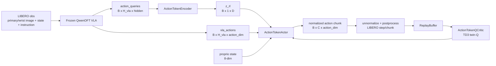
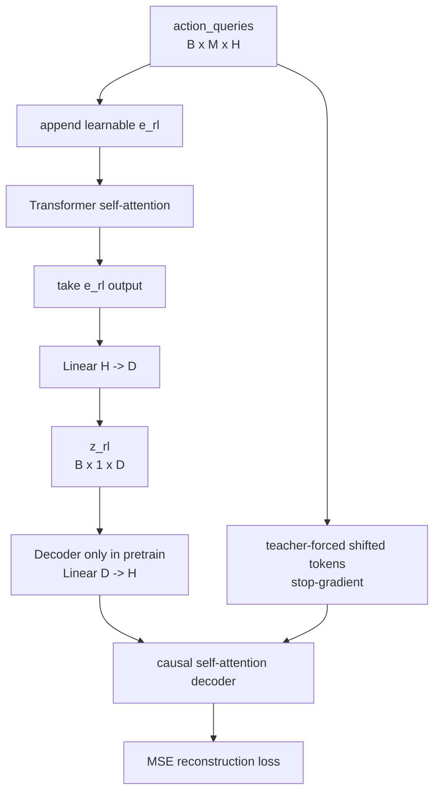
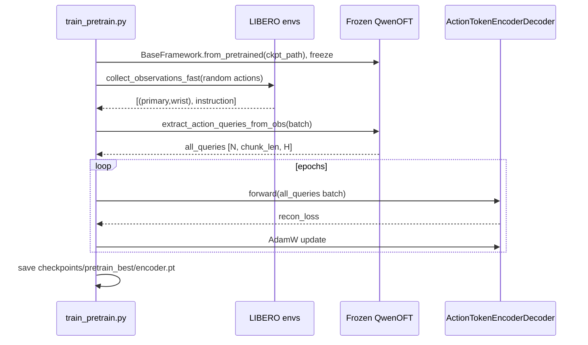
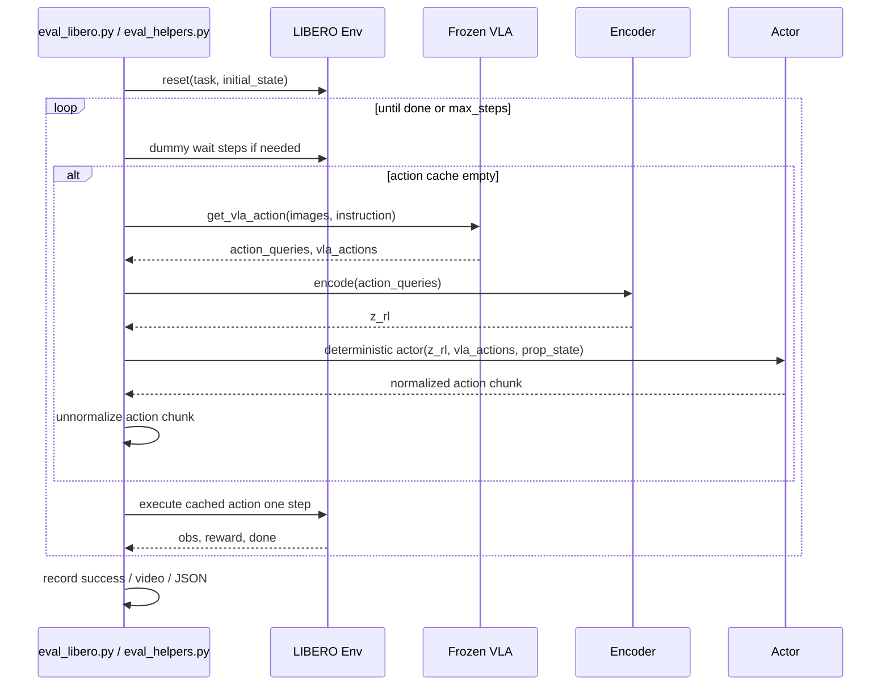

# RLT / RLActionToken 代码结构与训练推理逻辑

本文面向代码阅读，整理 AlphaBrain 中 RLT 相关模型的实现、模块职责、训练流程和推理流程。

如果你只关心 actor/action policy 和 critic 的训练样本如何产生、replay buffer 里存什么、TD3 target 和 actor loss 怎么对应代码，见 [RL Token Actor / Critic 训练数据流](rlt_actor_critic_dataflow.md)。

在当前仓库中，RLT 的实现名是 **`RLActionToken`**。这个名字是有意和 RL Token 论文区分开的：仓库实现保留“冻结 VLA + 瓶颈 token + 小型 actor-critic 在线 RL”的主线，但不是论文逐行复现。更详细的论文差异见 [`AlphaBrain/training/reinforcement_learning/algos/RLActionToken/README.md`](https://github.com/AlphaBrainGroup/AlphaBrain/blob/main/AlphaBrain/training/reinforcement_learning/algos/RLActionToken/README.md)。

---

## 一句话概览

RLActionToken 把一个已经 SFT 好的 QwenOFT VLA 冻结起来，用 VLA 的 action-token hidden states 训练一个信息瓶颈 encoder，得到紧凑的 `z_rl`。在线 RL 阶段只训练小型 actor 和 twin-Q critic：actor 以 `(z_rl, proprioception, VLA reference action)` 为输入，输出要执行的动作 chunk；critic 用 replay buffer 做 TD3 更新；推理时只需要 `VLA + encoder + actor`。



---

## 代码入口地图

| 路径 | 职责 |
|:--|:--|
| `scripts/run_rl_scripts/run_rlat_5traj_alltasks.sh` | 当前仓库中的端到端训练脚本：Phase 1 encoder pretrain + Phase 2 off-policy TD3。 |
| `scripts/run_rl_scripts/run_eval_action_token.sh` | 训练后评估脚本，把 LIBERO tasks 分片到多张 GPU 后聚合结果。 |
| `AlphaBrain/training/reinforcement_learning/trainers/train.py` | 统一 CLI 入口，根据 `--phase` 分发到 `pretrain`、`rl`、`rl_offpolicy`。 |
| `AlphaBrain/training/reinforcement_learning/trainers/train_args.py` | RLT 所有 CLI 参数：瓶颈维度、actor/critic hidden size、rollout 并发、TD3 超参等。 |
| `AlphaBrain/training/reinforcement_learning/trainers/train_pretrain.py` | Phase 1：冻结 VLA，收集 obs，提取 action queries，训练 encoder-decoder 重建。 |
| `AlphaBrain/training/reinforcement_learning/trainers/train_rl_offpolicy.py` | Phase 2 主路径：多 GPU rollout + CPU replay buffer + train GPU 上 TD3 更新。 |
| `AlphaBrain/training/reinforcement_learning/trainers/train_rl_onpolicy.py` | legacy PPO/on-policy 路径，文件注释明确说明不是当前 release 主路径。 |
| `AlphaBrain/training/reinforcement_learning/algos/RLActionToken/action_token_encoder_decoder.py` | `ActionTokenEncoder`、`ActionTokenDecoder`、`ActionTokenEncoderDecoder`。 |
| `AlphaBrain/training/reinforcement_learning/algos/RLActionToken/action_token_actor_critic.py` | `ActionTokenActor`、`ActionTokenQCritic`、legacy `ActionTokenCritic`、target soft update。 |
| `AlphaBrain/training/reinforcement_learning/algos/RLActionToken/action_token_trainer.py` | batched rollout server、episode 数据结构、buffer 写入、PPO legacy loss、TD3 actor/critic update、可选 VLA fine-tune。 |
| `AlphaBrain/training/reinforcement_learning/algos/RLActionToken/action_token_rollout_fast.py` | step-lock 快速 rollout：所有 env 同步批量 VLA forward，再并行执行动作 chunk。 |
| `AlphaBrain/training/reinforcement_learning/common/replay_buffer.py` | off-policy replay buffer，保存 `z_rl/ref_action/action/reward/next_z_rl/done/prop_state/task_id`。 |
| `AlphaBrain/training/reinforcement_learning/common/ckpt_io.py` | 保存 `encoder.pt`、`actor.pt`、`critic.pt`。 |
| `AlphaBrain/training/reinforcement_learning/envs/` | LIBERO subprocess worker、socket worker、persistent env pool。 |
| `AlphaBrain/training/reinforcement_learning/eval/` | deterministic eval、shard 聚合、训练中异步 eval 复用的 helper。 |
| `AlphaBrain/model/framework/QwenOFT.py` | RLT 依赖的 VLA 接口：`get_action_queries()`、`get_vla_action()`、action token hidden state 提取。 |

注意：旧版本文档中曾出现过 `run_action_token_5traj_alltasks.sh` 这个脚本名；当前仓库实际文件名是 `run_rlat_5traj_alltasks.sh`。

---

## 模型结构

### 1. 冻结 VLA：QwenOFT

RLT 默认围绕 QwenOFT 使用。相关代码在 `AlphaBrain/model/framework/QwenOFT.py`：

- `get_action_queries(batch_images, instructions)`：给 instruction 后拼接 action special tokens，把图像和语言送入 Qwen2.5-VL，取最后层 hidden states，再通过 `_gather_action_token_embeddings()` 抽出 action-token 位置的 hidden states。
- `get_vla_action(batch_images, instructions)`：先得到 `action_queries`，再用原 VLA 的 action head 预测 `vla_actions`。
- `_gather_action_token_embeddings(last_hidden, input_ids, action_token_id)`：取每个样本中最靠后的 `chunk_len` 个 action token hidden states，输出 `action_queries: [B, chunk_len, H]`。

因此当前实现不是从完整 image token 序列构造 RL token，而是从 VLA 已经用于动作预测的 action-token hidden states 构造。

### 2. Encoder / Decoder：信息瓶颈

代码：`action_token_encoder_decoder.py`

`ActionTokenEncoder`：

- 输入：`action_queries: [B, M, H]`。
- 追加一个可学习 `cls_token / e_rl`，得到 `[B, M + 1, H]`。
- 经过若干层 `TransformerEncoderLayer`。
- 取最后一个位置作为 RL token 表示。
- 再经过 `Linear(H -> bottleneck_dim)`，默认 `2048 -> 256`，输出 `z_rl: [B, 1, D]`。

`ActionTokenDecoder`：

- 只在 Phase 1 预训练使用，RL 和推理阶段不用。
- 把 `z_rl` 先 `Linear(D -> H)` 扩回 VLA hidden dim。
- 采用 prefix + causal self-attention 的 teacher forcing 结构，重建原始 `action_queries`。
- loss 是 `MSE(reconstructed, stop_grad(action_queries))`。



### 3. Actor：基于 VLA reference action 的动作编辑器

代码：`action_token_actor_critic.py`

`ActionTokenActor` 的输入是：

- `z_rl`：encoder 输出的紧凑状态。
- `prop_state`：8 维 proprioception，代码注释按 `eef_pos(3) + axisangle(3) + gripper(2)`。
- `vla_action`：冻结 VLA 给出的 reference action chunk。

actor 是一个 MLP，直接输出完整动作 chunk `action: [B, C, action_dim]`。它不是结构上的 residual head；VLA reference action 是网络输入，靠 actor loss 里的 BC 正则 `β ||a - ã||²` 保持靠近 VLA。训练时还会对 reference action 做 dropout，避免 actor 学成恒等映射。

输出分布是固定 std 的 Gaussian：

```text
pi_theta(a | z_rl, s_p, a_ref) = Normal(mu_theta(z_rl, s_p, a_ref), fixed_std^2 I)
```

推理/评估时 `deterministic=True`，直接使用均值动作。

### 4. Critic：TD3 twin-Q

代码：`action_token_actor_critic.py`

`ActionTokenQCritic` 是 TD3 风格的 twin Q network：

- 输入：`z_rl + prop_state + action_chunk`。
- 输出：`Q1, Q2`。
- critic target 用 `min(Q1_target, Q2_target)`。
- actor update 只用 `q1_forward()`，符合 TD3 常见实现。

文件里还有 `ActionTokenCritic`，它是只输入 `z_rl` 的 V(s) critic，目前主要给 legacy PPO/on-policy 路径和 rollout value logging 兼容使用，不是主 TD3 路径的核心 critic。

---

## Phase 1：Encoder-Decoder 预训练

入口：`train.py --phase pretrain` → `train_pretrain.run_pretrain(args)`

目标是训练 encoder 让 `z_rl` 保留 VLA action-query hidden states 的关键信息。训练完成后保存 `encoder.pt`，供在线 RL 阶段加载。



关键实现：

1. 加载并冻结 VLA：`BaseFramework.from_pretrained(args.ckpt_path)`，`requires_grad_(False)`。
2. 确定 `hidden_dim`、`chunk_len` 和 action normalization stats。
3. 用 `collect_observations_fast()` 收集观测。当前实现为了快，用 env reset + random action 收集图像和 instruction；这和论文中的 demonstration distribution 不完全一致。
4. 用 `extract_action_queries_from_obs()` 一次性批量提取所有 `action_queries`，之后释放 VLA，避免预训练时反复跑大模型。
5. 训练 `ActionTokenEncoderDecoder`，loss 是 action-query 重建 MSE。
6. 按 epoch 平均 loss 保存最佳 `encoder.pt`。

Phase 1 不训练 actor/critic，也不更新 VLA。decoder 的作用只是给 encoder 一个信息瓶颈训练目标；在线 RL 和推理时不会用 decoder。

---

## Phase 2：Off-policy TD3 在线 RL

入口：`train.py --phase rl_offpolicy` → `train_rl_offpolicy.run_rl_offpolicy(args)`

这是当前 release 的主训练路径。脚本 `run_rlat_5traj_alltasks.sh` 默认走这条路径。

### 初始化

`run_rl_offpolicy()` 做的主要事情：

1. 解析 `--rollout_gpus` 和 `--train_gpu`。
2. 每张 rollout GPU 加载一份冻结 VLA，用于并行采样。
3. train GPU 创建 `ActionTokenEncoderDecoder`，从 `--encoder_path` 加载 Phase 1 权重。
4. 默认冻结 encoder，原因是 replay buffer 里缓存的是旧 encoder 产生的 `z_rl`；如果边训练边改 encoder，buffer state 会失配。
5. 创建 actor、twin-Q critic、target actor、target critic。
6. 创建 rollout/eval 模块副本，创建 CPU replay buffer。
7. 根据 `--use_steplock` 选择 rollout 架构：
   - step-lock：`PersistentEnvPool + action_token_rollout_fast.py`
   - async server：`BatchInferenceServer + action_token_collect_group()`

### Rollout 采样逻辑

rollout 负责把当前 actor 放进环境里收集 episode。每个决策点的核心逻辑是：

```text
obs image/state + instruction
  -> frozen_vla.get_vla_action()
       action_queries, vla_actions
  -> encoder.encode(action_queries)
       z_rl
  -> actor(z_rl, vla_actions, prop_state)
       normalized action chunk
  -> unnormalize + postprocess
  -> LIBERO env step / step_chunk
  -> ActionTokenStepRecord
```

`ActionTokenStepRecord` 保存：

- `rl_token`
- `vla_action`
- `action_taken`
- `old_log_prob`
- `value`
- `prop_state`
- `sub_tokens`
- 可选 `images/instruction`，只在 `--finetune_vla` 时用于重新跑 VLA 梯度。

`ActionTokenEpisode` 再保存 episode 级信息：reward、success、task_id、env_steps、done 位置、video path 等。

### 两种 rollout 架构

#### BatchInferenceServer 路径

代码：`action_token_trainer.BatchInferenceServer`

多个 env thread 把推理请求塞进队列，server 后台线程在短 timeout 内攒 batch，然后一次性执行：

```text
batched images/instructions
  -> VLA forward
  -> encoder
  -> actor or pure VLA warmup
  -> 返回每个 env thread
```

这个路径会在 chunk 内 stride 位置采样中间观测，记录到 `sub_tokens`，用于 replay buffer 的 chunk subsampling。

#### Step-lock 路径

代码：`action_token_rollout_fast.py`

这是默认脚本开启的快速路径。所有 env 同步推进：

1. 并行 reset 所有 env。
2. 对所有 active env 做一个 batched VLA forward。
3. 批量 encoder + actor。
4. 每个 env 用 `step_chunk()` 一次执行一个动作 chunk。
5. 收集结果，未 done 的 env 进入下一轮。

step-lock 的优势是大 batch、更少 IPC、更少 batch fragmentation。实现注释里写的是“约 50x vs original”的优化方向。

需要注意一个实现细节：`push_episodes_to_buffer()` 支持 `[0, 2, 4, 6]` stride position 的 chunk subsampling；async server 路径会填充 `sub_tokens`。当前 step-lock 路径只保存 chunk-start 的 `ActionTokenStepRecord`，没有填充 `sub_tokens`，因此默认 `--use_steplock` 下 replay buffer 实际主要写入 chunk 起点 transition。

### Episode 到 ReplayBuffer

代码：`push_episodes_to_buffer()`

它把 episode records 转成 TD transition：

```text
(rl_token, vla_action, action_taken, reward,
 next_rl_token, next_vla_action, done,
 prop_state, next_prop_state, task_id)
```

reward 是 sparse success reward。成功 episode 的 terminal chunk 会按 chunk 内 done 位置折扣：

```text
reward_p = gamma_per_step ^ (done_step - p) * episode_reward
```

`ReplayBuffer.sample_balanced()` 支持多任务按 task_id 分层采样，避免某些 task 在 TD update 中被采样过多。

### TD3 更新

代码：

- critic update：`action_token_td_critic_update()`
- actor update：`action_token_td_actor_update()`
- soft update：`soft_update_target()`

critic target：

```text
next_action = target_actor(next_z_rl, next_vla_ref, next_prop, deterministic=True)
next_action = clamp(next_action + clipped_noise, -1, 1)
target = reward + gamma^C * min(Q1_target(next), Q2_target(next)) * (1 - done)
critic_loss = MSE(Q1, target) + MSE(Q2, target)
```

actor loss：

```text
action ~ actor(z_rl, vla_ref, prop)
actor_loss = -Q1(z_rl, action, prop).mean()
             + beta * ||action - vla_ref||^2
```

训练循环里的节奏：

1. rollout thread 持续采 episode 并推入 replay buffer。
2. 前 `warmup_iters` 使用 pure VLA action 采样，只预填 buffer，不让未训练 actor 直接控制环境。
3. buffer 达到 `buffer_warmup` 后开始 TD3。
4. 每次采样后按 `utd_ratio` 计算 TD 更新次数，并受 `td_updates_per_iter` 上限约束。
5. critic 每步更新；actor 每 `actor_update_freq` 步延迟更新。
6. target actor / target critic 做 Polyak averaging。
7. 每隔 `sync_every_n_updates` 把 train GPU 的 actor/encoder 权重同步给 rollout GPU 副本。
8. 按 `eval_interval` 异步评估，按 `save_interval` 保存 checkpoint。

### Optional：VLA fine-tune

`--finetune_vla` 会启用 `vla_finetune_step()`。它会保存 rollout 图像和 instruction，在训练端重新跑 VLA forward，使梯度沿：

```text
actor_loss -> actor -> z_rl -> encoder -> action_queries -> VLA
```

回传到 VLA 和 encoder。默认 release 脚本没有开启这条路径；主路径仍是冻结 VLA + 冻结 encoder + 只训练 actor/critic。

---

## 推理 / Evaluation 逻辑

离线评估入口：`AlphaBrain/training/reinforcement_learning/eval/eval_libero.py`

加载内容：

- `--vla_ckpt`：SFT 后的 QwenOFT VLA。
- `--action_token_ckpt/encoder.pt`：Phase 1 / Phase 2 保存的 encoder。
- `--action_token_ckpt/actor.pt`：TD3 训练后的 actor。

评估时不加载 decoder，不使用 critic，也不使用 replay buffer。



训练中的异步 eval 复用 `eval_helpers._eval_deterministic_local()`。`run_eval_action_token.sh` 则把 task ids 分配到多个 shard 进程，最后调用 `aggregate_shards.py` 生成 summary。

---

## Checkpoint 与产物

Phase 1：

```text
<PRETRAIN_DIR>/checkpoints/pretrain_best/encoder.pt
```

Phase 2：

```text
<OUTPUT_DIR>/checkpoints/rl_offpolicy_iter_00050/
  encoder.pt
  actor.pt
  critic.pt
<OUTPUT_DIR>/metrics.json
<OUTPUT_DIR>/videos/
```

推理评估只需要 `encoder.pt` 和 `actor.pt`，再配合原始 VLA checkpoint。

---

## 默认脚本的关键参数

`scripts/run_rl_scripts/run_rlat_5traj_alltasks.sh` 中的主配置：

| 参数 | 默认值 | 作用 |
|:--|:--|:--|
| `--bottleneck_dim` | `256` | `z_rl` 维度。 |
| `--encoder_layers / --encoder_heads` | `2 / 4` | encoder/decoder transformer 配置。 |
| `--actor_hidden_dim / --critic_hidden_dim` | `512 / 512` | actor 和 twin-Q MLP hidden size。 |
| `--ref_dropout` | `0.5` | 训练 actor 时随机置零 VLA reference action。 |
| `--fixed_std` | `0.1` | actor Gaussian exploration std。 |
| `--G_per_task` | `30` | 每个 main iteration 每个 task 收集的 episode 数。 |
| `--num_envs_per_task` | `10` | 每个 task 在每张 rollout GPU 上的并行 env 数。 |
| `--warmup_iters` | `5` | pure VLA rollout 预填 buffer 轮数。 |
| `--utd_ratio` | `10.0` | update-to-data ratio。 |
| `--td_updates_per_iter` | `10000` | 每轮 TD 更新上限。 |
| `--td_batch_size` | `1024` | replay buffer batch size。 |
| `--beta` | `1.0` | actor loss 里的 VLA reference BC 正则权重。 |
| `--actor_update_freq` | `2` | TD3 delayed actor update。 |
| `--target_noise_std / --target_noise_clip` | `0.2 / 0.5` | TD3 target policy smoothing。 |
| `--reward_coef` | `5.0` | success reward scaling。 |

代码支持 `--actor_chunk_len` 让 actor chunk `C` 小于 VLA chunk `H_vla`，但当前脚本没有显式传这个参数；不传时 `actor_chunk_len = VLA chunk_len`。

---

## 推荐阅读顺序

如果要理解整体逻辑，建议按这个顺序读：

1. `scripts/run_rl_scripts/run_rlat_5traj_alltasks.sh`：先看实际跑了哪些 phase 和参数。
2. `trainers/train.py`、`trainers/train_args.py`：理解 CLI 分发和配置面。
3. `model/framework/QwenOFT.py` 的 `get_action_queries()` / `get_vla_action()`：理解 RLT 从 VLA 拿什么表示。
4. `action_token_encoder_decoder.py`：理解 `z_rl` 怎么来。
5. `action_token_actor_critic.py`：理解 actor/critic 的输入输出和 loss 假设。
6. `trainers/train_pretrain.py`：理解 encoder 预训练。
7. `trainers/train_rl_offpolicy.py`：理解主训练循环、GPU 分工、rollout/update/eval/checkpoint。
8. `action_token_rollout_fast.py` 和 `action_token_trainer.py`：理解两种 rollout 和 replay buffer 写入。
9. `eval/eval_libero.py`、`eval/eval_helpers.py`：理解最终推理路径。

---

## 当前实现和论文 RLT 的主要差异

仓库实现已经在 `algos/RLActionToken/README.md` 里说明差异。阅读代码时最容易误解的点有：

- encoder 输入是 QwenOFT action-token hidden states，不是论文图中完整 image-token embeddings。
- encoder 后额外做了 `H -> bottleneck_dim` 投影，默认得到 256 维 token。
- decoder 是 prefix + causal self-attention，不是论文里的标准 cross-attention encoder-decoder。
- Phase 1 当前使用 random rollout observation，而不是 task demonstration。
- 当前主 release 路径默认冻结 VLA 和 encoder，只训练 actor/critic。
- human-in-the-loop、critical phase switching、policy handover learning 等论文机制没有在当前 release 路径里实现。

这份文档描述的是当前仓库可运行的 RLActionToken 实现，而不是论文的完整复现。
