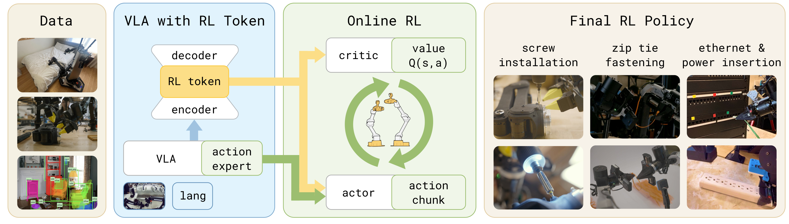
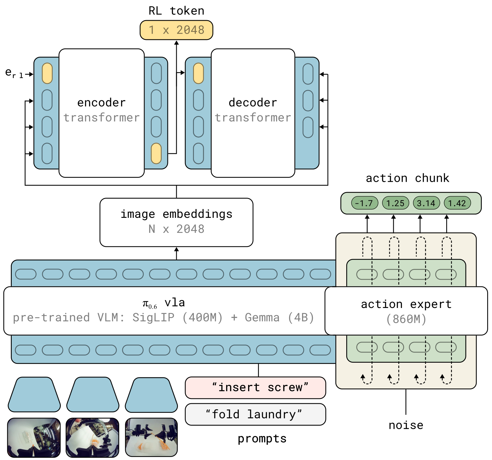
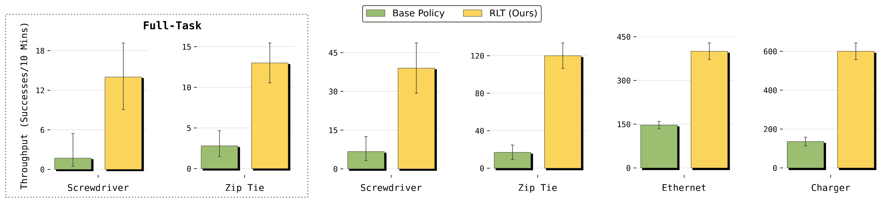
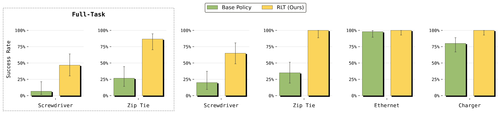
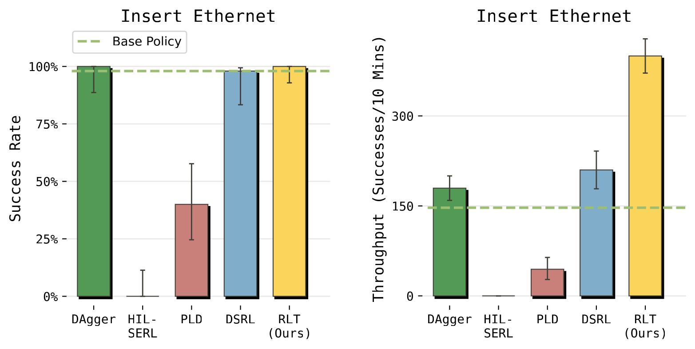
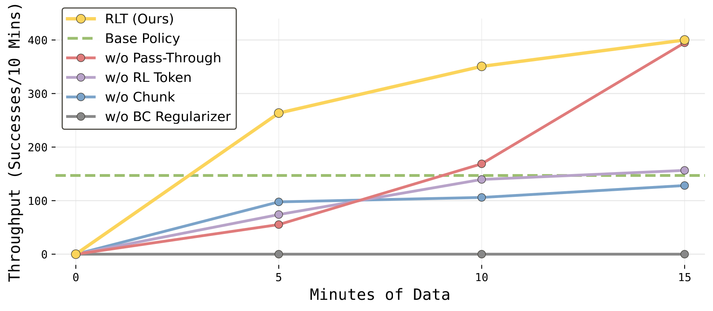
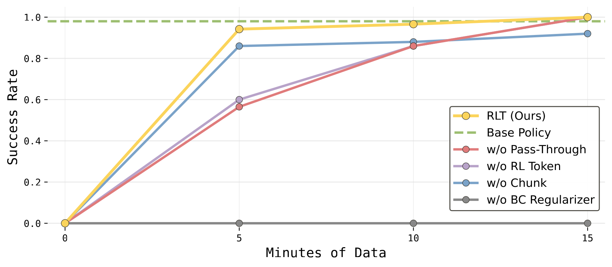
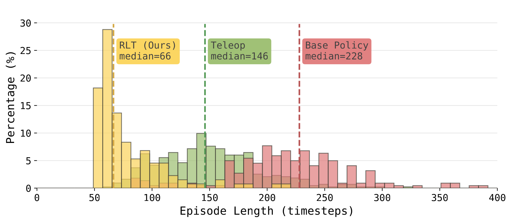

# RL Token：用视觉-语言-动作模型引导在线强化学习

Charles Xu, Jost Tobias Springenberg, Michael Equi, Ali Amin, Adnan Esmail, Sergey Levine, Liyiming Ke
Physical Intelligence
<https://pi.website/research/rlt>

*图 1：我们的方法通过训练一个编码器和解码器，在 VLA 中引入“RL token”，从 VLA 内部特征中产生紧凑且有意义的表示。提取出的表示随后用于以样本高效的在线 RL 训练轻量级 actor-critic 网络，使非常精密的任务能够在几小时甚至几分钟机器人经验内完成微调。*

## 摘要

视觉-语言-动作模型（vision-language-action, VLA）可以“开箱即用”地学习多种操作技能，但要达到真实任务所需的精度和速度，仍然需要进一步微调，例如通过强化学习（reinforcement learning, RL）。
我们提出一种轻量级方法，使预训练 VLA 能够仅用几小时真实世界练习完成样本高效的在线 RL 微调。我们首先让 VLA 暴露一个“RL token”，即一个紧凑的读出表示，它既保留任务相关的预训练知识，又可作为在线 RL 的高效接口；随后在这个 RL token 上训练一个小型 actor-critic head 来细化动作，同时把学到的策略锚定到 VLA。
基于 RL token 的在线 RL（RLT）使得即使是大型 VLA 也可以快速、高效地用 RL 微调。

在四个真实机器人任务中（螺丝安装、扎带固定、充电器插入和以太网插入），RLT 在任务最困难阶段将速度最高提升到原来的 3$\times$，并在几分钟到几小时练习内显著提高成功率。在部分任务上，它甚至可以超过人类遥操作的速度。

## 引言

通用视觉-语言-动作（VLA）模型可以从数据中学习大量多样的操作技能。然而，它们常常在执行的最后几毫米遇到困难：动作可能变慢，成功完成可能需要停顿和多次重试，精密任务关键阶段的小误差也可能累积成失败。解决这一问题的一种自然方式是使用强化学习（RL）微调 VLA。通过在目标任务上练习，RL 可以针对最影响成功的阶段进行改进，而这些阶段通常也是对小误差最敏感、最难仅靠示教数据可靠覆盖的阶段。但真实机器人受到严格预算约束：每个 episode 都需要时间，每次失败都消耗人力和设备寿命，有意义的适配往往必须在几小时练习内完成。

然而，对 VLA 做样本高效微调面临重大挑战。一方面，面向基础模型的常规 RL 训练方法 [1, 2, 3] 依赖大规模数据，对快速在线适配而言效率不足。另一方面，数据高效的真实世界 RL 方法 [4, 5] 通常训练更小的模型，这些模型可以在数小时内改进，但会牺牲 VLA 的泛化能力。因此，核心问题是：如何既利用 VLA 的泛化能力，又获得轻量级在线 RL 的速度和样本效率？

我们提出一个实用方案：用预训练 VLA 策略得到的表示来启动快速在线强化学习。核心想法是适配 VLA，使其暴露一个可用于样本高效在线 RL 的紧凑接口。具体来说，我们训练 VLA 暴露一个 *RL token*，它是一种压缩表示，可以让轻量级在线 RL 策略访问任务相关的预训练知识。使用该 RL token 运行 RL（RLT）形成了明确分工：冻结的 VLA 提供广泛的感知理解和动作建议，轻量级 actor 与 critic 则在线适配策略，使其在任务最困难部分成功执行。为了让这一方案适用于样本高效的真实世界场景，我们使用样本高效的在线 RL 算法训练小型 actor 和 critic 网络，这些网络使用 RL token 表示，并加入额外正则项将 actor 锚定到 VLA 动作，使在线 RL 细化已有的有希望行为，而不是从零学习。

我们在四个具有挑战性的机器人操作任务上评估 RLT，这些任务需要毫米级或亚毫米级精度：螺丝安装、扎带固定、以太网插入和充电器插入。
在这些任务中，RLT 在几小时在线训练内同时提升成功率和执行速度。最大收益出现在任务关键阶段，这些阶段需要高精度并决定任务成败；在这些阶段，RLT 将执行速度最高提升 3$\times$，并显著提高成功率，例如在困难螺丝插入任务上将成功率从 20% 提升到 65%。在部分最灵巧的任务阶段中，用我们方法训练的策略可以在保持可靠性的同时超过专家遥操作速度。这些结果表明，将 VLA 模型与轻量级在线 RL 结合，是实现高性能操作的一条实用途径，并且不需要大量任务特定工程。

## 相关工作

**视觉-语言-动作模型。**
从大规模示教数据进行行为克隆，近年来已经成为训练通用机器人操作策略的主流范式（例如 [6, 7, 8, 9, 10, 11]）。
推动这一进展的两个关键因素是动作块（action chunking）[12] 和表达能力强的输出分布。动作块可以一次预测多个动作并顺序开环执行；扩散 [13] 或自回归生成 [6] 等输出分布则可以捕捉示教数据中固有的多模态性。
进一步的发展来自使用大型预训练视觉-语言模型作为语言条件通用策略的 backbone，从而得到视觉-语言-动作（VLA）模型 [6, 7]。
这些模型把大规模网络先验知识引入闭环机器人策略。
近期工作将 VLA backbone 与分块动作生成结合，既可以通过扩散 [8]，也可以通过自回归 tokenization [14, 15]，并取得了先进的通用操作性能。
尽管这些策略表现出很强的泛化能力 [16, 9]，它们在任一具体任务上的性能最终仍受训练用遥操作数据质量和覆盖范围限制。当示教本身有噪声或不一致时，要在精度关键任务上获得可靠成功仍然困难。

**真实世界强化学习。**
强化学习提供了一种自然方式来突破示教数据的性能上限：通过在任务上练习，agent 可以发现更快、更精确或更鲁棒的策略，而这些策略可能从未在示教中出现过。
在实践中，机器人真实世界 RL 受到严格样本预算限制，因为每次机器人 rollout 都消耗时间和硬件寿命。
离策略 actor-critic 方法（例如 [17, 18, 19, 20]）通过复用 replay buffer 中的转移来缓解这一问题，提高 update-to-data ratio 还能进一步提升样本效率 [21]，但可能需要正则化来避免不稳定 [22]。
关键的是，离策略方法还可以引入人类示教数据来启动学习（例如 [23]），从而结合模仿学习与 RL 的优势。
越来越多工作发展了在物理机器人上部署 RL 的实用方案，包括自主数据收集流程 [24]、SERL [25, 4] 和 RL$^{100}$ [5] 等高效学习框架，以及允许操作员在自主执行中介入并提供纠正的人类在环变体 [4]。
这些系统表明，离策略 actor-critic 方法结合示教和人类纠正，可以在数小时机器人时间内解决接触丰富的操作任务。
然而，它们通常是在标准预训练视觉编码器（例如 ResNet）之上从零训练小策略，放弃了现代 VLA 模型中丰富的行为先验。
RLT 通过使用冻结 VLA 作为轻量级在线 RL 策略的感知 backbone 和行为先验，弥合了这一差距。

**VLA 模型的 RL 微调。**
如何通过 RL 改进预训练 VLA，是一个快速发展的研究方向。
这些方法的主要差异在于更新什么，以及如何注入 RL 信号。
在一端，一些方法更新完整 VLA 模型。
RECAP [3] 使用 advantage-conditioned policy extraction 通过离线 RL 端到端训练整个 $\pi^*_{0.6}$ 模型：一个分布式 value function 估计每个时间步的 advantage，VLA 则在所有收集到的数据上训练，包括示教、自主 rollout 和人类干预，并用 optimality indicator 提高高 advantage 动作的权重。
通过在机器人数据收集和离线 RL 更新之间迭代，RECAP 在 espresso 制作、衣物折叠和盒子组装等复杂长时程任务上使吞吐量超过翻倍。
其他工作将 proximal policy optimization（PPO）或其变体用于 VLA 微调（例如 [26, 27, 1]），但 on-policy 方法很难以样本高效且可扩展的方式扩展到真实世界 RL。
在另一端，轻量级方法避免更新完整 VLA，而是在冻结模型之上训练小型辅助模块。
ConRFT [28] 冻结 VLA encoder，并使用 consistency-based 训练目标和学习得到的二元 reward classifier 来微调 action head，但它在短时程任务上操作单步动作，没有动作块。
Policy Decorator [29] 学习 residual policy，其输出由手工调节的超参数缩放后加到冻结 VLA 的预测上，但只在仿真中展示，并且样本需求很高（百万步量级）。
Probe-Learn-Distill（PLD）[30] 先用 Cal-QL [31] 在 base-policy rollout 上预训练 critic，然后在冻结 VLA 之上学习单步 residual policy，并可选地通过监督微调把结果蒸馏回 VLA。
GR-RL [2] 采用多阶段方法，将通用 VLA 专门化到长时程鞋带系结任务：它先进行离线 filtered BC，然后通过学习 noise predictor 在 latent space 中引导冻结 VLA 的 diffusion process，从而执行在线 RL [32]。
DSRL [32] 同样工作在 diffusion noise space 中，学习一个 latent policy 来调制去噪过程，使动作向高回报区域移动。

RLT 与这些方法一样，目标都是在不承担完整模型 RL 成本的情况下改进预训练 VLA，但它在几个关键设计上不同。
首先，RLT 引入一个 *RL token*，它是被训练来压缩 VLA 内部 embedding 的紧凑读出表示，并作为轻量级 actor-critic 的状态观测，在保留 VLA 预训练感知结构的同时支持高效在线学习。
其次，RLT 使用与 VLA 原生动作接口对齐的 *chunked actions*，在高控制频率和稀疏奖励下缩短 temporal-difference 学习的有效决策 horizon；相比之下，单步方法 [28, 29, 30] 面临更长的 credit assignment 问题。
第三，RLT actor 并不预测 residual 或 latent noise，而是直接 *以 VLA 采样得到的参考动作块为条件，并向该动作块正则化*，从而把在线 RL 变成对良好 VLA 先验行为策略的局部细化，而不是无约束搜索或对 diffusion process 的隐式调制。
这些选择共同使真实机器人上的样本高效在线 RL 成为可能，并在几小时练习内同时提升成功率和执行速度。

## 预备知识

**视觉-语言-动作模型。**
大规模 VLA 模型从跨越数万小时的多样人类示教数据中学习操作行为，在某些情况下还会使用非机器人视觉-语言数据增强 [16, 9, 7]。典型 VLA 包含两个组件：（i）*VLM backbone*，即把图像、语言指令和本体状态编码为共享 token 序列的视觉-语言模型；（ii）*action expert*，即一个 diffusion-based 模块，它关注 backbone token，并通过迭代去噪生成连续动作。我们基于 $\pi_{0.6}$ 模型 [33]。给定最多四个相机图像、语言指令 $\ell$ 和本体状态 $\mathbf{s}^{\text{p}}_t$，$\pi_{0.6}$ 产生一个动作序列（称为 *action chunk*）：$\tilde{\mathbf{a}}_{t:t+H-1} = (\tilde{\mathbf{a}}_t, ..., \tilde{\mathbf{a}}_{t+H-1}) \in \mathbb{R}^{H \times d}$，其中 $H=50$ 个动作对应 1 秒控制。我们用 $\pi_{\text{vla}}$ 表示预训练 VLA 产生的分块策略。实践中，机器人只开环执行该 chunk 的一个前缀（例如前 20 步），然后基于新观测重新规划。
由于某些任务很困难（例如高精度任务），要为这些任务大规模收集高质量 imitation learning 数据会很有挑战，这限制了 VLA 在这些任务上的表现。这也推动了下一节提出的在线 RL 细化方法。

**强化学习与 actor-critic 方法。**
我们将机器人控制表述为 Markov decision process（MDP）$(\mathcal{S}, \mathcal{A}, p, r, \gamma)$，其中 $\mathcal{S}$ 是状态观测空间，$\mathcal{A}$ 是连续动作空间，$p(\mathbf{s}_{t+1} \mid \mathbf{s}_t, \mathbf{a}_t)$ 表示转移动态，$r(\mathbf{s}_t, \mathbf{a}_t)$ 是奖励函数，$\gamma \in [0,1)$ 是折扣因子。RL 的目标是学习一个策略 $\pi(\mathbf{a}_t \mid \mathbf{s}_t)$，最大化期望折扣回报：
$J(\pi) = \mathbb{E}_{\tau \sim \rho_\pi}\left[\sum_{t=0}^{T} \gamma^t r_t\right]$，
其中 $\rho_\pi(\tau)$ 表示策略 $\pi$ 诱导的轨迹分布。我们假设只能访问 *稀疏二元奖励*：人类监督者在每个 episode 结束时标注成功或失败，成功时设 $r_T = 1$，否则设 $r_T = 0$。策略 $\pi$ 的 action-value function 为：

$
Q^\pi(\mathbf{s}_t, \mathbf{a}_t)=
\mathbb{E}_{\tau \sim \rho_\pi}
\left[
\sum_{t'=t}^{T} \gamma^{t'-t} r_{t'}
\middle|
\mathbf{s}_t, \mathbf{a}_t
\right].
$

在我们的设置中，策略和 critic 都作用在动作块上：
$
\mathbf{a}_{t:t+C-1} = (\mathbf{a}_t, ..., \mathbf{a}_{t+C-1}) \in \mathbb{R}^{C \times d},
$
其中 $C$ 表示 RL chunk length，而 $H$ 表示 VLA 预测的 chunk horizon。我们选择 $C < H$，使策略更具反应性。我们定义 chunked policy 为 $\pi(\mathbf{a}_{t:t+C-1} \mid \mathbf{s}_t)$，并定义对应的 chunk-level C-step value estimate：
$
Q^\pi(\mathbf{s}_{t}, \mathbf{a}_{t:t+C-1}) = \sum_{t'=t}^{t+C-1} \gamma^{t'-t} r_{t'} + \gamma^C \mathbb{E}_{\mathbf{a}' \sim \pi | \mathbf{s}_{t+C}} \left[ Q^\pi(\mathbf{s}_{t+C}, \mathbf{a}') \right].
$
我们基于经典离策略 actor-critic 方法 [34, 17, 19]，联合训练随机 actor $\pi_\theta$ 和 critic $Q_\psi$。关键的是，学习是离策略的，使用 replay buffer $\mathcal{B}$ 中的转移，而不管这些转移由哪个策略生成。这个性质在我们的设置中至关重要，因为 $\mathcal{B}$ 会聚合来自 VLA 策略、RL learner 和人类遥操作干预的数据。

## 从 RL Token 进行强化学习

图 1 总结了我们使用 RLT 从预训练 VLA 模型实现快速、稳定在线 RL 的方案。核心思想是最大限度利用预训练 VLA 来提升 RL 训练过程的效率。用在线 RL 训练整个 VLA 可能计算成本太高、样本效率太低，无法在几小时内产生改进策略。相反，我们使用冻结 VLA 提供 RL 状态表示、提供参考动作，并引导探索靠近它自身预测的动作，同时仍然只使用小型 actor 和 critic 网络。
我们首先在少量任务特定示教数据上适配 VLA，既改善其初始任务策略，也让它暴露一个用于下游 RL 的 RL token。
随后我们冻结 VLA，并在线训练轻量级离策略 actor 和 critic 网络，使其同时以 RL token 表示和 VLA 参考动作为条件，

并把学到的策略正则化到接近 VLA 模型。

我们的方法把在线 RL 变成对有希望行为的局部细化，而不是无约束搜索。这一设计让在线 RL 方法具备小型 actor-critic 算法的效率，同时保留预训练 VLA 模型的表示和行为。

### 适配 VLA，使其暴露 RL 接口

*图 2：**RL token 提取细节。** RLT 向预训练 VLA 添加一个 encoder-decoder transformer。它产生 VLA 表示的压缩 embedding（RL token）。该表示随后支持在线 RL 中数据高效和参数高效的微调。*

样本高效在线 RL 强烈依赖状态表示的选择。直接把 RL 应用于完整 VLA 模型并不适合快速真实世界适配：表示维度很高，对十亿参数模型进行在线更新既计算昂贵又样本低效。同时，我们希望利用 VLA 预训练后内部已有的表示，因为它是在大规模网络和机器人数据上训练的，已经包含对许多任务生成动作有用的信息。然而，对于 transformer-based VLA 来说，哪一层、哪些特征构成适合在线 RL 的好表示通常并不明显，而且每层 transformer embedding 都是高维的。因此，我们的目标是将 VLA 表示压缩为一个紧凑 RL embedding，使其保留任务相关信息，同时足够小，能够用于轻量级在线 actor-critic 学习。

我们通过添加一个 *RL token*（图 2）实现这一点：它是一个可学习的读出 embedding，将 VLA 的知识汇总成一个小向量，用作 RL 状态。
具体来说，我们从添加到预训练 VLA 的小型额外 transformer 中获得 RL token。我们以 encoder-decoder [35] 方式训练该 transformer，其中 encoder 的最后一个输入是 RL token。由于 RL token 表示必须保留足够信息以使 decoder 能够重构输入，它形成了一个瓶颈。
令 $\mathbf{z} = f(s,\ell;\theta_{\text{vla}})$ 表示预训练 VLA 针对状态 $s$ 和语言指令 $\ell$ 产生的最终层 token embedding。embedding $\mathbf{z}$ 可分解为 $\mathbf{z}_{1:M} = \{\mathbf{z}_1,...,\mathbf{z}_M\}$，其中每个 $\mathbf{z}_i$ 对应一个输入 token 的 embedding。
我们向序列追加一个可学习 embedding $\mathbf{e}_\texttt{rl} = \mathbf{e}_\phi(\texttt{<rl>})$，并用轻量级 encoder transformer $g_\phi$ 处理增强序列。特殊 token 位置的 encoder 输出记为 $\mathbf{z}_{\text{rl}}$，这就是我们的 RL token（注：在我们的实验中，每个任务具有固定语言指令，因此在这一步丢弃语言 embedding；该构造一般适用于所有 VLA embedding）。

$$
\mathbf{z}_{\text{rl}} \;=\; g_\phi\!\bigl([\mathbf{z}_{1:M},\;\mathbf{e}_\texttt{rl}]\bigr)_{M+1}\,.
\tag{1}
$$

随后训练一个带线性输出投影 $h_\phi$ 的 decoder transformer $d_\phi$，从 $\mathbf{z}_{\text{rl}}$ 自回归重构原始 embedding。令 $\bar{\mathbf{z}}_i = sg(\mathbf{z}_i)$ 表示对 VLA embedding 应用 stop-gradient 后的结果，则在示教数据 $\mathcal{D}$ 上的自回归重构目标为：

$$
\mathcal{L}_{\text{ro}} = \mathbb{E}_{\mathcal{D}}\!\Bigl[\,
    \sum_{i=1}^{M}
      \bigl\lVert h_\phi\bigl(d_\phi([\mathbf{z}_{\text{rl}},\,\bar{\mathbf{z}}_{1:i-1}])\bigr)_{\!i}
        - \bar{\mathbf{z}}_i \bigr\rVert^2
  \,\Bigr].
\tag{2}
$$

我们在小规模任务特定示教数据集上训练参数 $\phi$；对于 $\mathcal{L}_{\text{ro}}$，VLA 被视为冻结，并且可以可选地结合 VLA $(\theta_{\text{vla}})$ 的监督微调。之后，$\theta_{\text{vla}}$ 和 $\phi$ 都被冻结，在线 RL 在 RL token 表示 $\mathbf{z}_{\text{rl}}$ 上运行。

### 在线 RL 细化 VLA 动作块

在初始适配阶段之后，我们冻结 VLA 和 RL token 表示。随后在线训练轻量级 actor（$\pi_\theta$）和 critic（$Q_{\psi}$）网络。它们的输入 $x$ 将 RL token 与对闭环控制有用的额外信息结合起来，例如机器人的本体状态。critic 模型估计状态和动作的价值：$Q_{\psi}(\mathbf{x},\mathbf{a}_{1:C})\in \mathbb{R}$。值得注意的是，RL actor $\pi_\theta(\cdot | \mathbf{x}, \tilde{\mathbf{a}}_{1:C})$ 并不是从零生成动作，而是被训练来细化 VLA 提议的动作序列 $\tilde{\mathbf{a}}_{1:C}$（称为 action chunks）。

**训练 critic。** 我们的 critic $Q_\psi( \mathbf{x},\mathbf{a}_{1:C})$ 以状态和动作块 $\mathbf{a}_{1:C}$ 为输入。我们在从 replay buffer $\mathcal{B}$ 采样的动作块转移上，用标准离策略 temporal-difference learning 训练 critic：

$$
\begin{aligned}
\mathcal{L}_Q&=\mathbb{E}_{(\mathbf{x}, \mathbf{a}_{1:C}, \mathbf{x}') \sim \mathcal{B}}
\Big[\big(\hat{Q}-Q_\psi(\mathbf{x}, \mathbf{a}_{1:C})
\big)^2\Big], \\
\hat{Q}&=\sum_{t'=1}^{C} \gamma^{t'-1} r_{t'}+\gamma^C\mathbb{E}_{\mathbf{a}' \sim \pi_\theta}
\Big[Q_{\psi'}(\mathbf{x}', \mathbf{a}')\Big].
\end{aligned}
\tag{3}
$$

其中输入状态为 $\mathbf{x} =(\mathbf{z}_\text{rl}, \mathbf{s}^\text{p})$，$\mathbf{s}^\text{p}$ 表示本体状态信息，$\mathbf{z}_\text{rl}(\mathbf{s})$ 表示从状态 $\mathbf{s}$ 提取的 RL token；$\mathbf{x}'$ 表示下一个输入状态；$\mathbf{a}' \sim \pi_\theta$ 表示从 RL policy 采样。在实践中，我们遵循 TD3 [19]，$\psi'$ 是 target network 的参数。

**训练 RL 策略。**
我们的 actor 网络 $\pi_\theta(\cdot| \mathbf{x},\tilde{\mathbf{a}}_{1:C})$ 在动作块上产生高斯动作分布。它接收输入状态 *以及* 参考动作块 $\tilde{\mathbf{a}}_{1:C}$，并产生动作分布：

$$
\pi_\theta\bigl(\mathbf{a}_{1:C} \mid \mathbf{x}, \tilde{\mathbf{a}}_{1:C}\bigr)
  =
  \mathcal{N}\Bigl(
    \mu_\theta\bigl(\mathbf{x}, \tilde{\mathbf{a}}_{1:C} \bigr),
    \sigma^2 \mathbf{I}
  \Bigr),
\tag{4}
$$

其中与前文一样，$\mathbf{x} =(\mathbf{z}_\text{rl}, \mathbf{s}^\text{p})$。
以 $\tilde{\mathbf{a}}$ 为条件，可以让 actor 直接看到 VLA 预测的动作，因此在线 RL 是在强初始提议之上进行细化，而不是从零学习。

第二个好处是，采样得到的参考 chunk 保留了 VLA 多模态动作分布中的 mode 信息，而单峰 Gaussian actor 否则很难恢复这些信息 [36]。
我们进一步通过把动作正则化到参考动作来稳定学习。具体而言，我们优化 actor，使其在保持靠近 VLA 参考 chunk $\tilde{\mathbf{a}}$ 的同时最大化 critic value，这与 KL-regularized RL 方法精神相似（例如 [37, 38, 20, 39, 40]）。这实际上把在线 RL 变成围绕 VLA 生成动作分布的局部动作编辑，而不是在高维动作块上进行无约束搜索。学习 RL 策略的目标为：

$$
\begin{aligned}
\mathcal{L}_{\pi}(\theta)
&=
\mathbb{E}_{\substack{\mathbf{s} \sim \mathcal{B} \\
\mathbf{a}_{1:C} \sim \pi_\theta}}
\left[
-\,Q_\psi(\mathbf{x}, \mathbf{a}_{1:C})
+\beta \left\|\mathbf{a}_{1:C}-\tilde{\mathbf{a}}_{1:C}\right\|_2^2
\right], \\
\qquad
& \qquad \tilde{\mathbf{a}}_{1:C}\sim\pi_{\mathrm{vla}}(\cdot\mid\mathbf{s}, \ell),
\end{aligned}
\tag{5}
$$

其中系数 $\beta$ 控制 actor 被正则化到采样 VLA 动作的强度。

**参考动作 dropout。** 参考动作 conditioning 的一个实际失败模式是 actor 可能只是复制 $\tilde{\mathbf{a}}$，而不是学习改进它。critic 尚未提供有效信息之前尤其容易发生这一点，因为 conditioning on $\tilde{\mathbf{a}}$ 和向它正则化都会鼓励 actor 保持接近 VLA 提议。为避免这一点，我们应用 *reference action dropout*：在每个训练 batch 中，对随机一部分 transition，把传入 actor 的参考 chunk 替换为零。这迫使 actor 保持一条独立动作生成路径，同时仍能在参考 chunk 存在时利用 VLA 动作分布。实践中，一旦 critic 提供有用信号，actor 会自然学会在提升预测价值时偏离参考动作。

**算法 1：RLT**

输入：冻结 VLA backbone $f_{\theta_\text{vla}}$ 和 VLA 动作分布 $\pi_{\text{vla}}$；示教数据 $\mathcal{D}$；chunk length $C$；replay buffer $\mathcal{B}$；warmup steps $N_{\text{warm}}$；update ratio $G$；VLA fine-tuning weight $\alpha$；policy constraint $\beta$。

1. **训练 RL token，并可选地微调 VLA。**
   使用 $\mathbf{z}_i=f_i(\mathbf{s}, \ell, \theta_\text{vla})$、$\mathbf{z}_{\text{rl}} = g_\phi([\mathbf{z}_{1:M}, \mathbf{e}_\text{rl}])_{M+1}$ 训练 $\phi$，并且仅当 $\alpha > 0$ 时训练 $\theta_\text{vla}$：

$$
\mathcal{L}_{\text{ro}}(\phi) = \mathbb{E}_{\mathcal{D}}\!\Bigl[\,
    \sum_{i=1}^{M}
      \bigl\lVert h_\phi\bigl(d_\phi([\mathbf{z}_{\text{rl}},\,\bar{\mathbf{z}}_{1:i-1}])\bigr)_{\!i}
        - \bar{\mathbf{z}}_i \bigr\rVert^2
  \,\Bigr].
$$

2. **优化读出目标和可选 VLA loss。**

$$
\phi, \theta_{\text{vla}} = \arg \min_{\phi, \theta_{\text{vla}}} \mathcal{L}_{\text{ro}}(\phi) + \alpha \mathcal{L}_{\text{vla}}(\theta_\text{vla})
$$

3. **初始化在线 RL。**
   初始化 critic $Q_\psi$ 和 RL policy $\pi_\theta$。

4. **对于环境步 $t=0,C,2C,\dots$：**
   采样 VLA 参考 chunk：
   $\tilde{\mathbf{a}}_{t:t+C-1}\sim \pi_{\text{vla}}(\mathbf{s}_t)$。

   构造 RL 状态：
   $\mathbf{x}_t = (\mathbf{z}_{\text{rl}}(\mathbf{s}_t), \mathbf{s}^p_t)$。

   选择动作 chunk：

$$
\mathbf{a}_{t:t+C-1} \leftarrow
\begin{cases}
\mathbf{a}^{\text{human}} & \text{if intervention} \\
\tilde{\mathbf{a}}_{t:t+C-1}        & \text{if } t < N_{\text{warm}} \\
\sim \pi_\theta(\,\cdot \mid \mathbf{x}_t,\tilde{\mathbf{a}}\,) & \text{otherwise}
\end{cases}
$$

   执行 $\mathbf{a}_{t:t+C-1}$，并观测 $r_t$、$\mathbf{s}_{t+1}$、$\mathbf{s}^p_{t+1}$。

   如果发生人类干预，则用人类动作替换参考动作：
   $\tilde{\mathbf{a}}_{t:t+C-1} \leftarrow \mathbf{a}^{\text{human}}$。

   将 transition 存入 $\mathcal{B}$：
   $\langle\mathbf{x}_t,\mathbf{a}_{t:t+C-1},\tilde{\mathbf{a}},r_t,\mathbf{x}_{t+1}\rangle$。

5. **对于 $g=1,\dots,G$，从 replay 中更新 actor 和 critic。**
   采样 batch $\mathrm{b} \sim \mathcal{B}$，并计算 target Q values：

$$
\hat{Q} = \sum_{t'=1}^C \gamma^{t' - 1} r_{t'} + \gamma^{C} \mathbb{E}_{\mathbf{a}' \sim \pi_\theta} \big[ Q_{\psi'}(\mathbf{x}', \mathbf{a}') \big]
$$

   使用式 (3) 的 TD backup 训练 critic：

$$
\mathcal{L}_Q(\psi) = \mathbb{E}_{\mathrm{b}} \Big[
    \big( \hat{Q} -   Q_\psi(\mathbf{x}, \mathbf{a}) \big)^2 \Big]
$$

   使用 $\mathbf{a} \sim \pi_\theta(\cdot\mid \mathbf{s},\tilde{\mathbf{a}})$ 和式 (5) 训练策略：

$$
\mathcal{L}_{\pi}(\theta)=\mathbb{E}_\mathrm{b}\Bigl[
      -Q_\psi(\mathbf{x},\mathbf{a})
      +\beta\|\mathbf{a}-\tilde{\mathbf{a}}\|_2^2
      \Bigr]
$$

## 完整系统

*图 3：**我们的实验任务**：每个任务都包含一个需要高精度的关键阶段：（上）使用螺丝刀安装螺丝，（中）固定扎带，（下）插入以太网线和插入充电器。*

算法 1 总结了完整训练循环。在初始 warmup 阶段用 base VLA policy 收集 episodes 之后，训练在机器人上收集经验和从 replay 中进行离策略 actor-critic 更新之间交替。replay buffer 聚合 VLA warmup 数据、在线 RL rollout 数据以及可选的人类干预。此外，人类监督者提供稀疏成功/失败标签。下面详细描述各步骤。

**Warmup。** 训练 RL token 表示之后（参见“适配 VLA，使其暴露 RL 接口”），我们通过 rollout VLA reference policy 来预填充 replay buffer $\mathcal{B}$，持续 $N_{\text{warm}}$ 个环境步。这为 critic 提供初始学习信号，并确保在线 RL 从有能力的 VLA 行为开始。

**Rollout。** 在在线收集期间，每个动作块边界处，冻结 VLA 产生参考 chunk $\tilde{\mathbf{a}}_{1:H}$，RL token 模块提取 $\mathbf{z}_{\text{rl}}$。随后 actor 输出动作块 $\mathbf{a}_{1:C} \sim \pi_\theta(\cdot \mid \mathbf{x}, \tilde{\mathbf{a}}_{1:C})$。
为了加速接触丰富或安全关键行为的学习，人类操作员可以选择介入，提供遥操作命令 $\mathbf{a}^{\text{h}}_{1:C}$，在干预持续期间覆盖 actor 输出。一旦发生这种情况，干预动作会替代 replay buffer 中的 VLA 参考。在所有情况下，存入 $\mathcal{B}$ 的每个 transition 都包含执行动作及其对应参考，使 actor 能够同时从自主 rollout 和人类纠正中学习。

**动作块子采样。** 虽然 RL policy 使用长度为 $C$ 的动作块，但我们会获得每个中间步的观测。因此，我们可以通过把中间步存入 replay buffer 来增加数据并提高学习效率。具体来说，我们选择 stride 为 $2$，并保存对应于 $<\mathbf{x_0}, \mathbf{a_{0:C}}>, <\mathbf{x_2}, \mathbf{a_{2:C+2}}>, <\mathbf{x_4}, \mathbf{a_{4:C+4}}>, ...$ 的 transitions 到 replay buffer。注意，由于我们的 RL 算法是离策略的，所有动作块都可以使用，包括 VLA 生成动作和人类干预。

**更新。** 策略更新根据算法 1 从 replay buffer 离策略执行。为了在训练时保持计算和时间效率，我们异步执行 rollout 和学习。实践中，每次 actor 更新对应两次 critic 更新，并在 warmup 阶段后不久开始学习。我们使用较高的 update-to-data ratio，即 $5$，这在低数据在线场景中很关键。

**关键阶段的定向改进。**

出于实用性和学习效率，我们将 RLT 应用于改进每个任务的关键阶段，也就是最困难且需要高精度的部分，并让 base VLA 执行任务中较容易的部分。

具体来说，每个 episode 先执行 base model。在数据收集期间，人类操作员可以选择何时把控制权从 base VLA 交给 RL policy。这类似于交互式 imitation learning [41] 中的人类干预决策。随后系统将 RL 应用于选定任务片段，在该关键阶段存储并训练 transitions，直到从人类操作员接收终止信号，指示 RL task 成功或失败。这把数据收集和 credit assignment 集中到在线适配最重要的行为部分。
为了在测试时实现自主执行，我们可以在训练结束时对 VLA 进行最后一个短暂微调阶段，让它额外预测何时把执行切换给 RL policy（用人类干预作为标签）。这样测试时就可以自动触发策略切换。

## 真实世界实验

我们在四个需要灵巧控制和亚毫米级精度的真实世界操作任务上评估 RLT。预训练 VLA 为这些任务的大多数部分提供强初始化，但任务成功和速度最终取决于对最需要精度的关键接触阶段进行细化。我们的实验检验该方法是否能在实际约束下提供这种改进：有限机器人交互时间、稀疏人类监督和轻量级在线学习。

我们围绕以下问题组织评估：

- **Q1.** RLT 能否相对于 base VLA model 改进操作性能？

- **Q2.** RLT 与这些任务上的其他 RL 方法相比表现如何？

- **Q3.** 方法的每个组成部分，包括 RL token、chunked action prediction、policy regularization 和 reference-action pass-through，对性能贡献多大？

- **Q4.** RLT 是否能让策略发现更好的策略行为？它的策略与原始示教数据相比如何？

### 任务与设置

我们在以下任务上评估方法（图 3）：

- **螺丝安装。** 机器人必须使用电动螺丝刀将 M3 螺丝拧入带螺纹的孔中。这要求螺丝头和螺丝刀尖之间达到亚毫米级对齐。该任务尤其困难，因为（1）螺丝不总是完全竖直，（2）抓握螺丝刀时，末端执行器的任何旋转都会被螺丝刀尖到抓握点之间 10 cm 的距离放大，（3）关键视觉线索主要来自另一只手臂上的广角腕部相机，形成了具有挑战性的感知问题。

- **扎带固定。** 机器人必须将扎带尾部穿过狭窄锁扣槽。该任务涉及对可变形物体进行协调双臂控制，并具有很小容差。成功插入要求仅从腕部相机推断尖端和锁扣槽位置，并以毫米级精度执行。

- **以太网插入。** 机器人必须将以太网接头插入凹陷接口。这需要准确的位置和角度对齐，随后执行坚定、果断的插入动作。小的姿态误差或犹豫接触通常会让接头卡在外壳上，而不是插入接口，使成功对精度和接触动态都很敏感。

- **充电器插入。** 机器人必须将充电器对齐并插入插排。该任务困难在于策略必须达到厘米级对齐，同时并不总能清晰观察到插脚和插孔。小的对齐误差常导致反复探测或插入失败。

每个任务都包含抓取、重新定位和对齐，持续 30–120 秒（在 50 Hz 下约 1500–6000 个控制步）。对每个任务，我们识别 *critical phase*，即插入、固定或旋转片段；这些片段精度要求最高，也是 base VLA 最常减速或失败的地方。这些阶段通常持续 5–20 秒（250–1000 个控制步）。

**关键阶段评估。**
由于我们的方法正是为了改进这些关键阶段，我们首先在只关注关键阶段的设置下比较方法和消融。在该设置中，episodes 从任务已部分完成、刚好位于关键阶段之前的状态开始，并使用略微随机化的初始配置。例如，在扎带固定中，机器人在插入尝试开始前已经握住扎带的两端。该设置隔离出 RL 预期最重要的精度关键片段，并减少任务早期阶段（如抓取和运输）带来的混杂方差；这些早期阶段已经能被 base VLA 较好处理。每个 agent 在该 controlled setting 中对每个任务评估 50 个 episodes。

**完整任务评估。**
Controlled critical-phase evaluation 有助于隔离我们方法要改进的瓶颈，但它不能捕捉长时程执行的完整变异性。因此，我们还在更真实的设置中评估 full-task performance：机器人从“home position”开始，用 base policy 执行任务早期阶段，并在该执行诱导出的状态变化下进入关键阶段。这一设置要难得多，因为 RL 改进后的行为必须在前序策略产生的更广泛状态分布下仍然有效。对于 full-task training，我们先让 RL 在小随机化的关键阶段上聚焦，然后转入完整任务设置。

**实验细节。**
RL policy 的输入包括 RL token（由两个腕部相机图像和一个底座相机图像产生）以及额外本体状态。根据任务不同，辅助状态可能包括关节位置（螺丝任务）、末端执行器位姿（扎带、以太网和充电器）。我们使用 $\pi_{0.6}$ [33] 作为 base VLA policy。机器人以 50 Hz 控制频率运行。每个时间步动作空间为 14 维，因此 RL actor 的 chunked action 为 140 维。更多实现细节见附录“额外实验细节”。

### Baselines 与消融

*图 4：**RLT 相比 base VLA policy 显著提升吞吐量**，同时改善每个任务关键阶段的速度和一致性。对于 VLA policy 容易犯错的较难任务，这种提升尤其明显。*

*图 5：**RLT 可以提升多个任务的成功率**。当 VLA 已经表现较好时（例如以太网任务），它保持成功率并提高吞吐量。对于 base VLA policy 较难的任务（螺丝刀和扎带），RLT 显著提高成功率。*

我们从预训练 VLA 模型 $\pi_{0.6}$ [33] 开始。
对每个任务，我们收集 $1$–$10$ 小时遥操作示教。随后我们在训练 RL token 表示的同时微调 VLA 模型。

这产生了我们在所有实验中使用的 base VLA policy。根据任务难度，我们运行 RL training 400 到 1000 个 episodes。除去 reset 和各种 overhead，每个实验实际产生约 15 分钟到 5 小时机器人数据。我们用成功率评估性能，成功率由人类操作员给出的二元奖励信号判断。我们还报告 throughput，即每 10 分钟成功完成任务的次数，以评估鲁棒性和速度的改进。我们在所有任务的关键阶段上评估，并在两个较难任务（螺丝和扎带）上评估完整任务设置。

我们将 RLT 与四个从经验中改进策略的 baseline 方法比较。为公平比较，我们用相同数据量训练每个 RL 方法（见附录“baselines 的额外实验细节”）。

- **HIL-SERL** [4]：与我们的方法类似，HIL-SERL 用经验和干预结合训练小型 actor 和 critic；但与 RLT 不同，它不使用来自预训练 VLA 的表示，而是使用一个为标准计算机视觉任务预训练的简单 ResNet encoder。

- **Probe-Learn-Distill** [30]：PLD 学习一个 residual policy，为每个单步动作输出 residual。它用超参数缩放 residual，并将其与冻结 VLA 动作预测中的一步相加后执行。

- **DSRL** [32]：DSRL 在 flow VLA 模型的 latent noise space 中学习在线 RL policy。它通过选择输入冻结 VLA action generator 的 noise 来“steer” VLA 动作生成。该方法隐式地将探索限制在 VLA 可生成的动作中，并在其 modes 之间探索。

- **DAgger** [42, 41]：我们用训练期间收集的人类干预数据微调 base VLA model。

我们还通过逐个移除组件来隔离方法各部分的贡献：

- **w/o RL token**：用来自 [25] 的冻结 ImageNet 预训练 ResNet-10 encoder 替换 RL token。

- **w/o Chunk**：RL policy 输出单步动作（$C{=}1$），而不是动作块。由于该策略需要以 50 Hz 运行，而以 50 Hz 查询 base VLA model 并不可行，我们必须用 ResNet-10 encoder 替换 RL token。

- **w/o BC Regularizer**：在式 (5) 中设置 $\beta{=}0$；策略只用 $Q$-function 训练。

- **w/o Pass-Through**：从式 (4) 的 policy 输入中移除 $\tilde{\mathbf{a}}$；RL actor 只从状态和 RL token 生成动作。

### 实验结果

*图 6：**与其他 RL 算法比较。** 我们将 RLT 与近期 RL 文献中的多个 baseline 比较。只考虑单步动作而非动作块的方法（HIL-SERL、PLD）表现较差。DSRL 成功率较高，但吞吐量明显落后。*

**Q1：在线 RL 是否优于 base VLA policy？**

我们在两种设置中评估方法：隔离关键阶段的 *controlled* 设置，以及要求 RL policy 更鲁棒的 *full-task* 设置。

*在线 RL 在两种设置中都提升了 base model 的成功率和执行速度*。在 controlled setting 中，RLT 在四个任务上都稳定改进关键阶段。即使在相对简单的充电器和以太网任务上，base policy 已经较可靠，RLT 学到的策略在关键阶段也约快 $3{\times}$。成功率提升在更难的扎带和螺丝刀任务上更明显。在 full-task evaluation 中，由于任务早期部分（抓取/举起物体等）的误差会累积，整体成功率更低，但 RLT 仍然让螺丝刀任务成功率提升 40%，让扎带任务成功率提升 60%。

**Q2：RLT 与其他方法相比如何？**

如图 6 所示，*RLT 相比 baselines 显著提升吞吐量*。我们在以太网任务上与四个 baselines 比较。HIL-SERL 和 PLD 都是单步在线 RL 方法，它们无法在该任务上有效学习，因为该任务跨越数百步且奖励稀疏。没有动作块时，任务 horizon 很长，value function 更新无法有效传播稀疏奖励信号。对于这一较简单任务，DAgger 和 DSRL 的成功率与 RLT 相近（图 6），但速度提升显著较小。DAgger 是 imitation learning 方法，因此受到人类示教和干预速度限制。DSRL 是一种 RL 方法，它强约束策略保持接近 base VLA，从而训练稳定，但改进潜力相对较小。相比之下，RLT 在匹配 base policy 高成功率的同时，将平均完成步数相对 base policy 降低了 $2{\times}$。

**Q3：每个组件贡献多大？**

*四个设计选择：RL token、action chunks、BC regularizer 和 reference-action pass-through，都有重要贡献*。

我们验证了方案中每个组件都带来正向贡献（图 7）：用 ResNet-10 encoder 替换 RL token 会使吞吐量降低 $50$%，说明我们的 token 编码了 off-the-shelf 标准视觉任务 encoder 所不具备的操作相关结构。把 chunks（$C{=}10$）替换为单步动作会显著增加任务的有效 horizon，因为 value function 需要在更长 horizon 上进行 credit assignment。这也会让我们的方法无法实际使用 RL token。实践中，单步变体无法可靠匹配 base policy 性能。
移除 BC regularizer（$\beta{=}0$）导致最大的单项性能下降，因为它迫使 actor 只依赖 $Q$-function 梯度在完整动作空间中探索。移除 reference-action pass-through 会减慢学习，导致早期 exploration drift，并偶尔出现退化行为。该消融在这个较简单任务上最终确实能达到 RLT 的性能，但训练过程中失败更多，如图 7 的学习曲线所示。

*图 7：**以太网任务中训练不同阶段的吞吐量。** 消融研究显示，我们方法的每个部分都对良好性能很重要，完整系统学习最快且最终表现最好。值得注意的是，RLT 在只消耗关键任务阶段 5 分钟数据后就超过替代策略（总实验时间约 $\sim$40 分钟）。从 actor 输入中去掉参考动作（“w/o Pass-Through”）仍可达到最佳最终性能，但代价是学习更慢，训练过程中失败显著更多。*

*图 8：**以太网任务训练期间的成功率评估。** RLT 在以太网插入任务上快速匹配 VLA policy 的成功率，同时提升吞吐量。不使用 reference-action pass-through 或不使用 RL token 都会导致学习更慢。*

**Q4：RLT 是否产生更有效的涌现策略？**

*图 9：**以太网任务速度。** RLT 显著提升以太网任务速度。最终策略甚至比专家遥操作产生的示教更快，也显著快于 base VLA model。在关键插入阶段，一半 RL episodes（黄色）比所有遥操作示教（绿色）都更快。*

除了汇总指标，在线 RL 的效果还体现在机器人 *如何* 执行任务上的定性变化。对于以太网任务的关键阶段，我们可视化了遥操作示教、base policy 和最终 RL policy 的速度分布（图 9）。base VLA 在接触附近经常表现出“probing”行为：接近目标、略微后退、重新调整、再尝试，有时在成功前循环数次。RLT 则接近接口，并以流畅动作插入接头。即使第一次尝试失败，RLT 也会施加压力并轻微摆动接头以利用顺应性，从而更快插入。这种行为没有出现在示教数据中，而是纯粹由在线探索产生，说明该方法可以超越对人类策略的模仿。

## 结论

我们提出了 RLT，一种基于大型预训练 VLA 提取表示进行快速在线 RL 的方法。通过训练 VLA 暴露紧凑表示，我们的方法使轻量级 actor 和 critic 能够仅用几小时真实世界练习来改进高精度、精细任务。在四个需要精度和速度的困难任务中，RLT 稳定提升成功率和执行速度，在每个任务最困难阶段达到最高 3× 加速，并且在某些情况下，通过在线 RL 涌现出的策略超过专家人类遥操作速度。

尽管 RLT 学习快速且高效，但训练期间仍需要额外人类干预，以提供奖励信号、干预纠正，并在 RL（关键阶段）和 base policy（其他阶段）之间切换。原则上，这些组件中的一部分可以自动化，例如使用 reward models 和 progress prediction。基于 RLT 开发全自主 RL 改进流程，是一个有前景的未来方向。更广泛地说，我们认为该方法朝着不仅能从示教数据学习、还能直接在工作中改进的机器人系统迈出了重要一步。当改进足够快速且可靠时，VLA 的预训练阶段只需为下游探索提供良好初始化，而最成功、最高性能的策略可以通过强化学习发现。我们希望 RLT 能成为迈向这一未来的一步。

## 致谢

机器人研究是一项团队工作。我们感谢 Physical Intelligence 的所有成员，他们在硬件、数据收集、机器人操作和机器人基础设施等多个方面为这项工作做出了贡献。我们感谢 Liam Murphy 和 Cameron Myers 在夹爪设计上的帮助。我们感谢机器人操作员以及 PI 的运营和标注团队。我们感谢 Connor Jacobsen 对网站和博客文章的帮助，Brian Ichter 对图示的帮助，Kyle Vedder 的校对，Claudio Guglieri 对博客可视化的帮助，以及 Donald Jewkes 和 Thomas Burton 在视频拍摄和剪辑上的帮助。

## 参考文献

[1] Haozhan Li, Yuxin Zuo, Jiale Yu, Yuhao Zhang, Zhaohui Yang, Kaiyan Zhang, Xuekai Zhu, Yuchen Zhang, Tianxing Chen, Ganqu Cui, Dehui Wang, Dingxiang Luo, Yuchen Fan, Youbang Sun, Jia Zeng, Jiangmiao Pang, Shanghang Zhang, Yu Wang, Yao Mu, Bowen Zhou, Ning Ding. SimpleVLA-RL：通过强化学习扩展 VLA 训练。arXiv preprint, arXiv:2509.09674, 2025.

[2] Yunfei Li, Xiao Ma, Jiafeng Xu, Yu Cui, Zhongren Cui, Zhigang Han, Liqun Huang, Tao Kong, Yuxiao Liu, Hao Niu, Wanli Peng, Jingchao Qiao, Zeyu Ren, Haixin Shi, Zhi Su, Jiawen Tian, Yuyang Xiao, Shenyu Zhang, Liwei Zheng, Hang Li, Yonghui Wu. GR-RL：面向长时程机器人操作的灵巧与精确执行。2025. arXiv:2512.01801. URL https://arxiv.org/abs/2512.01801.

[3] Physical Intelligence. $\pi^*_0.6$：一个从经验中学习的 VLA。2025. arXiv:2511.14759. URL https://arxiv.org/abs/2511.14759.

[4] Luo, Jianlan, Xu, Charles, Wu, Jeffrey, Levine, Sergey. 通过人类在环强化学习实现精确灵巧机器人操作。arXiv preprint arXiv:2410.21845, 2024.

[5] Kun Lei, Huanyu Li, Dongjie Yu, Zhenyu Wei, Lingxiao Guo, Zhennan Jiang, Ziyu Wang, Shiyu Liang, Huazhe Xu. RL-100：基于真实世界强化学习的高性能机器人操作。2026. arXiv:2510.14830. URL https://arxiv.org/abs/2510.14830.

[6] Anthony Brohan, Noah Brown, Justice Carbajal, Yevgen Chebotar, Xi Chen, Krzysztof Choromanski, Tianli Ding, Danny Driess, Avinava Dubey, Chelsea Finn, Pete Florence, Chuyuan Fu, Montse Gonzalez Arenas, Keerthana Gopalakrishnan, Kehang Han, Karol Hausman, Alex Herzog, Jasmine Hsu, Brian Ichter, Alex Irpan, Nikhil Joshi, Ryan Julian, Dmitry Kalashnikov, Yuheng Kuang, Isabel Leal, Lisa Lee, Tsang-Wei Edward Lee, Sergey Levine, Yao Lu, Henryk Michalewski, Igor Mordatch, Karl Pertsch, Kanishka Rao, Krista Reymann, Michael Ryoo, Grecia Salazar, Pannag Sanketi, Pierre Sermanet, Jaspiar Singh, Anikait Singh, Radu Soricut, Huong Tran, Vincent Vanhoucke, Quan Vuong, Ayzaan Wahid, Stefan Welker, Paul Wohlhart, Jialin Wu, Fei Xia, Ted Xiao, Peng Xu, Sichun Xu, Tianhe Yu, Brianna Zitkovich. RT-2：视觉-语言-动作模型将网络知识迁移到机器人控制。arXiv preprint arXiv:2307.15818, 2023.

[7] Kim, Moo Jin, Pertsch, Karl, Karamcheti, Siddharth, Xiao, Ted, Balakrishna, Ashwin, Nair, Suraj, Rafailov, Rafael, Foster, Ethan, Lam, Grace, Sanketi, Pannag et al.. OpenVLA：一个开源视觉-语言-动作模型。arXiv preprint arXiv:2406.09246, 2024.

[8] Physical Intelligence. $\pi_0$：用于通用机器人控制的视觉-语言-动作 flow 模型。arXiv preprint arXiv:2410.24164, 2024.

[9] Gemini Robotics Team, Saminda Abeyruwan, Joshua Ainslie, Jean-Baptiste Alayrac, Montserrat Gonzalez Arenas, Travis Armstrong, Ashwin Balakrishna, Robert Baruch, Maria Bauza, Michiel Blokzijl, Steven Bohez, Konstantinos Bousmalis, Anthony Brohan, Thomas Buschmann, Arunkumar Byravan, Serkan Cabi, Ken Caluwaerts, Federico Casarini, Oscar Chang, Jose Enrique Chen, Xi Chen, Hao-Tien Lewis Chiang, Krzysztof Choromanski, David D'Ambrosio, Sudeep Dasari, Todor Davchev, Coline Devin, Norman Di Palo, Tianli Ding, Adil Dostmohamed, Danny Driess, Yilun Du, Debidatta Dwibedi, Michael Elabd, Claudio Fantacci, Cody Fong, Erik Frey, Chuyuan Fu, Marissa Giustina, Keerthana Gopalakrishnan, Laura Graesser, Leonard Hasenclever, Nicolas Heess, Brandon Hernaez, Alexander Herzog, R. Alex Hofer, Jan Humplik, Atil Iscen, Mithun George Jacob, Deepali Jain, Ryan Julian, Dmitry Kalashnikov, M. Emre Karagozler, Stefani Karp, Chase Kew, Jerad Kirkland, Sean Kirmani, Yuheng Kuang, Thomas Lampe, Antoine Laurens, Isabel Leal, Alex X. Lee, Tsang-Wei Edward Lee, Jacky Liang, Yixin Lin, Sharath Maddineni, Anirudha Majumdar, Assaf Hurwitz Michaely, Robert Moreno, Michael Neunert, Francesco Nori, Carolina Parada, Emilio Parisotto, Peter Pastor, Acorn Pooley, Kanishka Rao, Krista Reymann, Dorsa Sadigh, Stefano Saliceti, Pannag Sanketi, Pierre Sermanet, Dhruv Shah, Mohit Sharma, Kathryn Shea, Charles Shu, Vikas Sindhwani, Sumeet Singh, Radu Soricut, Jost Tobias Springenberg, Rachel Sterneck, Razvan Surdulescu, Jie Tan, Jonathan Tompson, Vincent Vanhoucke, Jake Varley, Grace Vesom, Giulia Vezzani, Oriol Vinyals, Ayzaan Wahid, Stefan Welker, Paul Wohlhart, Fei Xia, Ted Xiao, Annie Xie, Jinyu Xie, Peng Xu, Sichun Xu, Ying Xu, Zhuo Xu, Yuxiang Yang, Rui Yao, Sergey Yaroshenko, Wenhao Yu, Wentao Yuan, Jingwei Zhang, Tingnan Zhang, Allan Zhou, Yuxiang Zhou. Gemini Robotics：把 AI 带入物理世界。2025. arXiv:2503.20020. URL https://arxiv.org/abs/2503.20020.

[10] Hongtao Wu, Ya Jing, Chilam Cheang, Guangzeng Chen, Jiafeng Xu, Xinghang Li, Minghuan Liu, Hang Li, Tao Kong. 为视觉机器人操作释放大规模视频生成式预训练能力。2023. arXiv:2312.13139.

[11] NVIDIA, :, Johan Bjorck, Fernando Castañeda, Nikita Cherniadev, Xingye Da, Runyu Ding, Linxi "Jim" Fan, Yu Fang, Dieter Fox, Fengyuan Hu, Spencer Huang, Joel Jang, Zhenyu Jiang, Jan Kautz, Kaushil Kundalia, Lawrence Lao, Zhiqi Li, Zongyu Lin, Kevin Lin, Guilin Liu, Edith Llontop, Loic Magne, Ajay Mandlekar, Avnish Narayan, Soroush Nasiriany, Scott Reed, You Liang Tan, Guanzhi Wang, Zu Wang, Jing Wang, Qi Wang, Jiannan Xiang, Yuqi Xie, Yinzhen Xu, Zhenjia Xu, Seonghyeon Ye, Zhiding Yu, Ao Zhang, Hao Zhang, Yizhou Zhao, Ruijie Zheng, Yuke Zhu. GR00T N1：面向通用人形机器人的开放基础模型。2025. arXiv:2503.14734. URL https://arxiv.org/abs/2503.14734.

[12] Tony Z. Zhao, Vikash Kumar, Sergey Levine, Chelsea Finn. 使用低成本硬件学习细粒度双手操作。2023. arXiv:2304.13705. URL https://arxiv.org/abs/2304.13705.

[13] Chi, Cheng, Xu, Zhenjia, Feng, Siyuan, Cousineau, Eric, Du, Yilun, Burchfiel, Benjamin, Tedrake, Russ, Song, Shuran. Diffusion policy：通过动作扩散学习视觉运动策略。The International Journal of Robotics Research, pages 02783649241273668, 2023.

[14] Pertsch, Karl, Stachowicz, Kyle, Ichter, Brian, Driess, Danny, Nair, Suraj, Vuong, Quan, Mees, Oier, Finn, Chelsea, Levine, Sergey. Fast：用于视觉-语言-动作模型的高效动作 tokenization。arXiv preprint arXiv:2501.09747, 2025.

[15] Suneel Belkhale, Dorsa Sadigh. MiniVLA：更小规模、更好用的 VLA。2024. URL https://github.com/Stanford-ILIAD/openvla-mini.

[16] Physical Intelligence. $\pi_0.5$：具有开放世界泛化能力的视觉-语言-动作模型。9th Annual Conference on Robot Learning, 2025.

[17] Haarnoja, Tuomas, Zhou, Aurick, Abbeel, Pieter, Levine, Sergey. Soft actor-critic：带随机 actor 的离策略最大熵深度强化学习。International conference on machine learning, pages 1861–1870, 2018.

[18] Lillicrap, Timothy P, Hunt, Jonathan J, Pritzel, Alexander, Heess, Nicolas, Erez, Tom, Tassa, Yuval, Silver, David, Wierstra, Daan. 使用深度强化学习进行连续控制。arXiv preprint arXiv:1509.02971, 2015.

[19] Fujimoto, Scott, van Hoof, Herke, Meger, David. 解决 actor-critic 方法中的函数逼近误差。arXiv preprint arXiv:1802.09477, 2018.

[20] Abbas Abdolmaleki, Jost Tobias Springenberg, Yuval Tassa, Remi Munos, Nicolas Heess, Martin Riedmiller. 最大后验策略优化。International Conference on Learning Representations (ICLR), 2018. URL https://openreview.net/forum?id=S1ANxQW0b.

[21] Marcel Hussing, Claas Voelcker, Igor Gilitschenski, Amir-massoud Farahmand, Eric Eaton. 解剖高更新比深度 RL：对抗 value divergence。2024. arXiv:2403.05996. URL https://arxiv.org/abs/2403.05996.

[22] Chen, Xinyue, Wang, Che, Zhou, Zijian, Ross, Keith. 随机化集成 double q-learning：不使用模型也能快速学习。arXiv preprint arXiv:2101.05982, 2021.

[23] Ball, Philip J, Smith, Laura, Kostrikov, Ilya, Levine, Sergey. 使用离线数据进行高效在线强化学习。International Conference on Machine Learning, pages 1577–1594, 2023.

[24] Zhu, Henry, Yu, Justin, Gupta, Abhishek, Shah, Dhruv, Hartikainen, Kristian, Singh, Avi, Kumar, Vikash, Levine, Sergey. 真实世界机器人强化学习的要素。arXiv preprint arXiv:2004.12570, 2020.

[25] Luo, Jianlan, Hu, Zheyuan, Xu, Charles, Tan, You Liang, Berg, Jacob, Sharma, Archit, Schaal, Stefan, Finn, Chelsea, Gupta, Abhishek, Levine, Sergey. SERL：用于样本高效机器人强化学习的软件套件。2024 IEEE International Conference on Robotics and Automation (ICRA), pages 16961–16969, 2024.

[26] Allen Z. Ren, Justin Lidard, Lars Lien Ankile, Anthony Simeonov, Pulkit Agrawal, Anirudha Majumdar, Benjamin Burchfiel, Hongkai Dai, Max Simchowitz. Diffusion Policy Policy Optimization。Proceedings of the 2025 International Conference on Learning Representations (ICLR), 2025.

[27] Kang Chen, Zhihao Liu, Tonghe Zhang, Zhen Guo, Si Xu, Hao Lin, Hongzhi Zang, Quanlu Zhang, Zhaofei Yu, Guoliang Fan, Tiejun Huang, Yu Wang, Chao Yu. $\pi_RL$：面向 flow-based 视觉-语言-动作模型的在线 RL 微调。arXiv preprint, arXiv:2510.25889, 2025.

[28] Chen, Yuhui, Tian, Shuai, Liu, Shugao, Zhou, Yingting, Li, Haoran, Zhao, Dongbin. ConRFT：基于一致性策略的 VLA 模型强化微调方法。arXiv preprint arXiv:2502.05450, 2025.

[29] Yuan, Xiu, Mu, Tongzhou, Tao, Stone, Fang, Yunhao, Zhang, Mengke, Su, Hao. Policy Decorator：面向大型策略模型的模型无关在线细化。The Thirteenth International Conference on Learning Representations, 2025.

[30] Wenli Xiao, Haotian Lin, Andy Peng, Haoru Xue, Tairan He, Yuqi Xie, Fengyuan Hu, Jimmy Wu, Zhengyi Luo, Linxi "Jim" Fan, Guanya Shi, Yuke Zhu. 通过 residual RL 数据生成实现自改进视觉-语言-动作模型。2025. arXiv:2511.00091.

[31] Nakamoto, Mitsuhiko, Zhai, Simon, Singh, Anikait, Sobol Mark, Max, Ma, Yi, Finn, Chelsea, Kumar, Aviral, Levine, Sergey. Cal-QL：用于高效在线微调的 calibrated offline RL pre-training。Advances in Neural Information Processing Systems, 36, pages 62244–62269, 2023.

[32] Andrew Wagenmaker, Mitsuhiko Nakamoto, Yunchu Zhang, Seohong Park, Waleed Yagoub, Anusha Nagabandi, Abhishek Gupta, Sergey Levine. 用 latent space 强化学习引导你的 diffusion policy。Proceedings of the 9th Conference on Robot Learning (CoRL), 2025.

[33] Physical Intelligence. $\pi_0.6$ Model Card。2025. URL https://website.pi-asset.com/pi06star/PI06_model_card.pdf.

[34] Heess, Nicolas, Wayne, Gregory, Silver, David, Lillicrap, Timothy, Erez, Tom, Tassa, Yuval. 通过 stochastic value gradients 学习连续控制策略。Advances in Neural Information Processing Systems, 28, 2015. URL https://proceedings.neurips.cc/paper_files/paper/2015/file/148510031349642de5ca0c544f31b2ef-Paper.pdf.

[35] Sutskever, Ilya, Vinyals, Oriol, Le, Quoc V. 使用神经网络进行序列到序列学习。Advances in neural information processing systems, pages 3104–3112, 2014.

[36] Seohong Park, Qiyang Li, Sergey Levine. Flow Q-Learning。International Conference on Machine Learning (ICML), 2025.

[37] Peng, Xue Bin, Coumans, Erwin, Zhang, Tingnan, Lee, Tsang-Wei, Tan, Jie, Levine, Sergey. 通过模仿动物学习敏捷机器人运动技能。RSS, 2020.

[38] Peters, Jan, M\"ulling, Katharina, Alt\"un, Yasemin. 相对熵策略搜索。Proceedings of the Twenty-Fourth AAAI Conference on Artificial Intelligence, pages 1607–1612, 2010.

[39] Dayan, Peter, Hinton, Geoffrey E.. 使用期望最大化进行强化学习。Neural Computation, 9, pages 271–278, 1997. DOI 10.1162/neco.1997.9.2.271.

[40] Sergey Levine. 作为概率推断的强化学习与控制：教程与综述。2018. arXiv:1805.00909. URL https://arxiv.org/abs/1805.00909.

[41] Michael Kelly, Chelsea Sidrane, Katherine Driggs-Campbell, Mykel J. Kochenderfer. HG-DAgger：与人类专家交互式模仿学习。2019. arXiv:1810.02890. URL https://arxiv.org/abs/1810.02890.

[42] Ross, Stephane, Gordon, Geoffrey, Bagnell, Drew. 将模仿学习和结构化预测归约为 no-regret online learning。Proceedings of the Fourteenth International Conference on Artificial Intelligence and Statistics, 15, pages 627–635, 2011. URL https://proceedings.mlr.press/v15/ross11a.html.

## 附录

### 贡献

CX 和 LK 发起了该项目。CX 构建了在线 RL 的基础设施。JTS 设计并训练了 RL token。ME 构建了干预界面。AA 和 AE 设计并制造了夹爪和机器人硬件。CX、LK 设计了系统实现、任务套件和实验。SL、LK 在整个项目中提供建议。LK、CX、JTS、SL、ME 参与了写作、插图和视频制作。

### 额外实验细节

首先，我们在目标任务上收集示教数据集；随后在单任务数据上微调 base VLA model，并训练 RL token 2000 到 10000 个 gradient steps。在线 RL 训练期间，VLA 随后被冻结。

在线 RL 期间，对于扎带固定、以太网和充电器插入任务，我们从零初始化 RL actor 和 critic，使用两层 MLP（hidden dimension 256）。对于更具挑战性的螺丝安装任务，我们使用更大的网络，即三层 MLP，hidden dimension 为 512。两个网络都接收冻结 base VLA model 产生的 RL token、本体位置和速度作为输入。critic 使用两个 Q functions 的 ensemble 训练，遵循 Fujimoto et al. [19]，并用两个 Q functions 的最小值计算 target values。actor 额外接收 VLA model 产生的参考动作 chunk；训练时该输入以 50% 概率被 mask，推理时始终提供。actor 参数化为 Gaussian policy，固定小标准差，从当前观测输出动作 chunk $\mathbf{a}_{t:t+C-1} \in \mathbb{R}^{C \times d}$，其中 $C{=}10$。为提高样本效率，训练期间我们以相隔 2 个控制步的方式对子动作块采样，因此每秒数据大约产生 25 个 RL 网络样本。训练期间，当 RL task 完成时，操作员提供稀疏 +1 奖励。

对于螺丝安装和扎带固定任务，我们先只在 critical-phase setting 中开始 RL training。随后进入 full task phase：先运行 base model 完成任务非关键阶段，然后在到达关键阶段时切换到 RL policy。这种两阶段训练策略提升训练效率，同时确保 RL policy 对任务早期 base policy 诱导出的初始分布具有鲁棒性。我们报告的是收集约 5 小时数据后的策略性能。

### baselines 的额外实验细节

对于所有 baseline 方法，我们使用与我们方法相同的环境和动作空间设置，即策略在 50 Hz 下以 delta action space 执行。

**PLD**：遵循原论文，我们首先用 50 个 base policy rollouts 和 Cal-QL [31] 预训练 critic network，以获得更好的样本效率。随后进入 online RL stage。

**DSRL**：遵循原始实现，我们的实现预测一个 $(1, 32)$ 维 latent action，并在第一维重复 $50$ 次，以匹配 action-chunk VLA 的 noise input space。

**HIL-SERL**：遵循原始实现，我们用 20 个 demonstration episodes 初始化 RLPD training，并在整个训练过程中提供干预。然而，它在我们的设置中无法成功，因为我们的控制频率更高（50 Hz，而原系统为 10 Hz），并且缺少用于减小 exploration space 的 action-space bounding box。

**DAgger**：我们使用示教数据和在线 RL 训练期间收集到的同一组干预数据混合微调 VLA。
